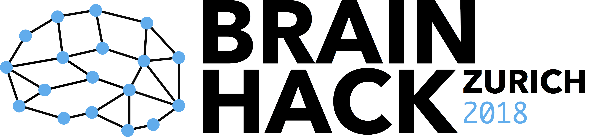
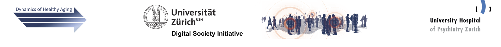

# Brainhack Zurich 2018, May 2-4
### Open tools for reproducible neuroscience

We are happy to announce the second Brainhack in Zurich. It will be held at the University Research Priority Program Dynamics of Healthy Aging at UZH on May 2 - 4 2018 as part of [Brainhack Global](http://brainhack.org/global2018/).

## The Zurich Brainhack will feature

* Introductory hands-on **tutorials** on (neuroimaging) data analysis tools which promote reproducible science (e.g. BIDS and BIDS Apps)
* A **hackathon** where participants can intensely collaborate on projects (for instance by discussing best practices in a field or developing a software package)
* **Talks** by invited speakers (for instance a video keynote lecture by Daniel Lakens) and talks by the participants
* A **helpdesk** where participants can ask experts about software/data analysis issues  (e.g. Linux, Python, MATLAB, SPM, EEG) in a one-to-one setting

## The format

During the three days event we will host a hackathon. The hackathon will give you an opportunity to collaborate on projects. You can suggest projects and look for collaborators, or join an existing project. Throughout the hackathon, there will be talks and tutorials, that you can attend if they interest you - alternatively, you can also continue working on the projects.

## Projects

Participants can propose projects that they would like to work on during the hackathon or join an existing project. The projects will be listed on our website. To propose a project, fill out [this form](https://goo.gl/forms/Pk14z4UyX2mUc2er1).
**A list of projects can be found [here](projects.html)**

## Provisional schedule

|                  |           |                                                                                        |                                                                   |
|------------------|-----------|----------------------------------------------------------------------------------------|-------------------------------------------------------------------|
| **May 2**        |           |                                                                                        |                                                                   |
| 9:00 - 9:30        |           |                                                                                        | Introduction to Brainhack, presentation of the space and schedule |
| 9:30 - 10:30       |           | Participants                                                                           | Project pitches                                                   |
| 10:30 -          | Hackathon |                                                                                        | Open Hacking                                                      |
| 13:30 - 14:30      | Tutorial  | [Horea Christian](https://www.researchgate.net/profile/Horea_Christian)                                                                        | Introduction to GitHub                                            |
| 14:30 - 15:30      | Talk      | [Tyler Thrash](http://www.geo.uzh.ch/geolean/en/units/giva/staff/?content=tylerthrash) | The Future of Geographic Information Displays.                    |
| 16:00 - 17:30 | Keynote   | [Daniel Lakens](http://daniellakens.blogspot.com)                                      | Towards a more transparent and reliable science                   |
| 18:00            |           |                                                                                        | Dinner                                                            |
|                  |           |                                                                                        |                                                                   |
| **May 3**        |           |                                                                                        |                                                                   |
| 9:00 -           | Hackathon |                                                                                        | Open Hacking                                                      |
| 10:00 - 11:00    | Tutorial  | [Horea Christian](https://www.researchgate.net/profile/Horea_Christian)                | Introduction to BIDS                                              |
| 11:00 - 12:00    | Tutorial  | [Franz Liem](http://www.dynage.uzh.ch/en/aboutus/team/postdocs/fliem.html)             | Introduction to BIDS Apps                                         |
| 14:00 - 16:00    | Helpdesk  |                                                                                        |                                                                   |
| 16:00 - 17:00    | Talk      | [Mathias Müller](http://www.cl.uzh.ch/de/people/team/compling/mmueller.html)           | Neural networks and machine translation                           |
|                  |           |                                                                                        |                                                                   |
| **May 4**        |           |                                                                                        |                                                                   |
| 9:00 - 16:00     | Hackathon |                                                                                        | Open Hacking                                                      |
| 13:00 - 14:00    | Talk      | [Diana Wotruba](https://www.dianawotruba.com)                                          | VR                                                                |
| 14:00 - 16:00    | Tutorial  | Alex Crimi                                                                             | Connectivity toolboxes (Dipy, Brainnetviewer, NeuroCave..)        |
| 16:00 -          |           | Participants                                                                           | Project wrap up                                                   |

## Registration and further information

The admission is free but [registration](https://goo.gl/forms/Ss9dlfuGWzqsuy6y1) until **April 18** is required.

The event will be held at the University Research Priority Program Dynamics of Healthy Aging at UZH, Andreasstrasse 15, 8050 Zurich.

## FAQ

* *I attended last year's event. What will be different?*
    * We now also host a hackathon that allows for a more free-form collaboration.
    * We aim for a less dense schedule that leaves more opportunities for open discussion.
    * We aim for tutorials that are even more hands-on so that you can continue using the tools after the event.
    * Our hope is that you come and hang out together for a couple of days. Collaborate on topics that interest you, attend tutorials that interest you, give talks if you want to, and make the event what you want it to be.
* *Wait, what is a hackathon?*
    * A bottom-up driven event where people intensely collaborate for a couple of days on a project (and, ideally, continue collaborating after the hackathon). The project usually is focused on developing software. However, we want to expand the hackathon concept beyond just software. A project might be a discussion group about analysis approaches for data, about open scientific tools, about ensuring that research projects are reproducible....
* *I do not know how to write code. Can I still participate?*
    * Sure. We want to reach researchers of all levels of experience. Our hope is that Brainhack will introduce you to tools that you can use for your future research and will also guide you towards creating your own tools.
* *I am a bachelor's/master's student. Can I still participate?*
    * Sure.
* *I am interested in open science, but I am not in neuroscience. Can I still participate?*
    * Sure. While we focus on brain imaging, there will be topics relevant to other fields as well.
    All the talks will have a non-brain-imaging-focus.
    The *Introduction to GitHub tutorial* will also be relevant to a
    wide audience.
* *I do not have a project to propose.*
    * That's OK. Our hope is that you join a project that excites you.

Don't hesitate to get in touch with questions: [brainhack.zh@gmail.com](mailto:brainhack.zh@gmail.com)

## We hope to see you soon

Alessandro Crimi, Amelie Haugg, Horea Christian, Franz Liem, Jessica Oschwald, Frank Scharnowski, Ronald Sladky

## Previous events
For Brainhack Zurich 2017 info click [here](https://dynage.github.io/brainhack-zh/)

## Sponsors
